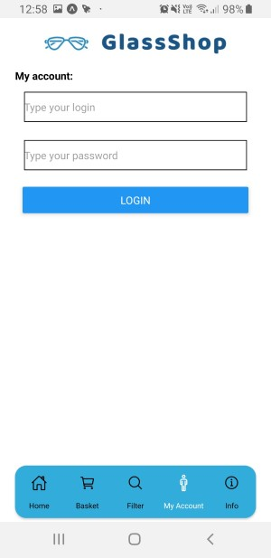

# Mobile app for MS-Shop application

## Running app:

Dev mode: `yarn start`
You should create `.env` file with:
``` 
DB_HOST: your_database_ip //e.q.: 192.168.0.1 
DB_PORT: your_port //e.q.: 5432
```


Normal mode: go Google Play and download app (currently unavailable)

## Screenshots:




